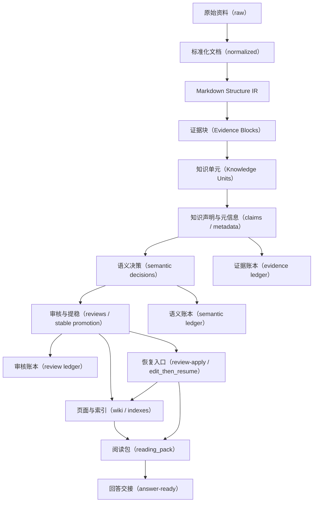

# MyAgentWiki 系统详细设计

## 文档目标（Document Purpose）

本文档是 `MyAgentWiki` 的主详细设计文档，也是当前最优先维护的单一权威版本。

它主要服务两类读者：

- 第一读者是项目作者自己，用来反向检查“系统为什么这样实现、哪些地方已经落地、哪些地方仍需继续收口”。
- 第二读者是后续协作者，用来快速建立对目录边界、数据模型、处理流程、证据链、语义链和恢复机制的整体理解。

本文档强调三件事：

1. 文档结构尽量与系统处理流程一致，方便一边读一边对照实现。
2. 英文术语只在必要时保留，并在首次出现时给出明确中文解释。
3. 除了说明“系统怎么做”，还尽量说明“为什么这样做”。

本文档中的 `MyAgentWiki` 统一指母仓库 / 产品名；若需要举用户初始化后的工作区目录示例，统一使用 `MyNotesWiki`。

## 概要（Summary）

`MyAgentWiki` 的定位不是“传统脚本流水线上补几处大模型（LLM）调用”，而是一个证据优先的语义编译器（evidence-first semantic compiler）。

它的核心任务，是把用户的原始资料持续编译成三层产物：

1. 证据层：`normalized/`、Markdown 结构中间表示、证据块（Evidence Blocks）、知识单元（Knowledge Units）、`claims/`
2. 语义层：语义决策（semantic decisions）、知识角色（knowledge roles）、页面意图（page intents）
3. 展示层：`wiki/`、`indexes/`、阅读包（reading_pack）、回答交接载荷（answer-ready payload）

因此，系统主线不应再理解为“把文件切成句子，再把句子拼成页面”，而应改成下面这条结构优先的编译链：

1. `raw -> normalized Markdown`：把异构来源统一成 Markdown 表达
2. `normalized Markdown -> Markdown Structure IR`：解析标题、段落、列表、表格、引用、代码块、行号和父子关系
3. `Markdown Structure IR -> Evidence Blocks`：形成可回链、可引用、可组合的原文结构块
4. `Evidence Blocks -> Knowledge Units`：从结构块中抽取候选知识对象，保留局部标题、上下文和结构元信息
5. `Knowledge Units -> claims / metadata / semantic decisions`：把事实声明、结构字段和语义判断分层落账
6. `semantic decisions -> reviews / stable promotion / page routing`：把无法安全自动收口的部分送入审核，把高把握对象送入后续页面重建
7. `pages / indexes / reading_pack / answer-ready`：把证据和语义结果编译成面向人和面向上层 Agent 的不同视图

系统的关键能力包括：

- 从用户原始知识目录同级初始化一个新的 Wiki 工程
- 支持 `Word / Excel / PDF / Markdown / 图片` 五类输入
- 维护结构优先的 Markdown 中间表示，避免过早按句子或换行丢失上下文
- 维护独立的知识单元层（Knowledge Unit layer）和声明层（Claim layer）
- 建立 `page -> claim -> knowledge_unit -> evidence_block -> source` 的可追踪证据链
- 用多字段 BM25、页面类型权重、页面状态权重组织检索
- 用受控 LLM 处理脚本难以稳定解决的知识单元抽取、语义角色判定、页面意图判定、保守重命名和 grounded 改写
- 用审核队列、提稳流程、账本收口和回放机制保证长期可维护性

系统的核心设计哲学是：

- 确定性证据优先，按需使用语义判断（deterministic evidence first, semantic where needed）
- Markdown 结构优先，局部关键词只能作为弱特征，不能单独决定知识角色或页面目录
- 脚本负责证据编译、schema 校验、grounded 校验和状态落盘，LLM 负责受限语义分析、候选提案和 grounded 表达
- LLM 不是事实来源，不能绕过现有证据直接制造新事实
- LLM 输出默认是 proposal，只有通过脚本校验、回链校验和状态机约束后，才能进入 live 账本
- 所有高风险改动都必须有可追踪账本、可回读证据和明确恢复入口

## 系统定位与核心原则（System Positioning And Principles）

### 1. 证据优先，而不是页面优先

系统的主真相不应是最终页面文本，而应是证据图（evidence graph）。

原因是页面文本天然更适合给人阅读，但不适合作为长期演化中的唯一权威源：

- 页面会被重写、重排、重命名
- 页面会同时服务概念解释、综述组织、来源入口、问答沉淀等多种视图
- 页面中的可读表达可能被 LLM 改写，而证据层不应该随表达风格变化而漂移

因此，系统必须先让 `normalized / Markdown Structure IR / Evidence Blocks / Knowledge Units / claims` 稳定下来，再决定页面怎么组织。

### 2. LLM 是受限语义分析器，不是事实写作者

LLM 在系统中的职责是：

- 判断文档结构是否可靠
- 在已解析的 Evidence Block 上抽取 Knowledge Unit，或从同一证据范围内为 Knowledge Unit 补充局部标题、父级章节、字段名等上下文
- 判断 Knowledge Unit / Claim 更像定义、事实、步骤、示例、结构元信息还是结构壳
- 判断一组稳定 Knowledge Unit / Claim 更适合长成概念页、指南页、示例页、主题页、参考页还是只留在来源视图
- 在证据和页型都已确定后，做 grounded 的可读化表达

LLM 不应直接做的事包括：

- 跳过 `normalized / Evidence Blocks / Knowledge Units / claims` 直接写知识页
- 把没有来源支持的句子写入权威账本
- 在没有回链对象的情况下生成“看起来很合理”的新事实
- 把推断、常识、行业经验或补充解释伪装成原文事实
- 把审核动作、生命周期变化、规范名归属等高风险状态修改成纯自由文本结论

LLM 输出的每个候选对象都必须携带回链依据，例如 `evidence_block_id`、`source_refs`、`start_line / end_line`、`reason_code`。如果无法回链，输出只能作为临时分析结果，不得进入 live 证据账本。

这里的“补全”只允许补上下文，不允许补事实。

例如原文结构是：

```text
- 平台运营组
  负责人：人员A
```

LLM 可以帮助形成“平台运营组负责人是人员A”这类有结构来源的候选事实；但不能进一步写成“人员A负责平台整体运营管理”，除非 Evidence Block 中已有等价表达。

### 3. 语义层必须独立成账本

语义判断不能直接混入证据账本并成为权威字段，否则系统会失去可回放性。

例如同一条 Knowledge Unit / Claim：

- 它的 `knowledge_unit_id / claim_id`、`source_refs`、`lifecycle_status` 属于证据和生命周期真相
- 它是否更像 `definition / procedure / example / structural_shell`，则属于语义判断真相

这两类信息分层保存的好处是：

- 模型升级、提示词升级时，可以只重跑语义层
- 证据层不需要因为语义策略变动而整体重写
- query、lint、review、page rebuild 都能解释“这次为什么这么做”

证据账本里可以保存语义决策的投影字段，方便检索和调试；但这些投影字段不能成为权威来源。权威来源应是 `SemanticDecision` 或等价语义账本，并通过 `semantic_decision_id`、`semantic_decision_version` 或输入指纹回链。

### 4. 审核不是兜底补丁，而是恢复机制的一部分

审核队列（review queue）不只是“发现问题后提醒人看一眼”，它是整套编译系统中正式的暂停点和恢复入口。

原因是：

- 不是所有风险都能靠脚本或 LLM 收口
- 高风险变化如果没有暂停点，系统就会把不确定判断直接写进 live 页面和索引
- 一旦后面又要恢复，就很难知道应该从哪一层继续

因此，review item 必须携带：

- 风险原因
- 候选对象
- 关键证据
- 允许动作
- 恢复起点

这样 `review-apply` 才能成为真正的“状态恢复命令”，而不是“帮用户改一两个字段”的工具。

## 端到端处理流程（End-to-End Flow）

### 总流程图



### 证据主链（Evidence Chain）

证据主链回答的是：“系统为什么能说这句话？”

这条链固定为：

`source -> normalized -> structure_block -> evidence_block -> knowledge_unit -> claim / metadata -> page`

读者需要能够从页面一路回读到声明、知识单元、证据块、标准化文档和原始来源，而不是停留在一段被改写过的摘要上。

`chunk` 仍可作为检索和增量处理的粗粒度容器，但它不应再承担“最小证据单元”的全部职责。真正的证据原子应是 Evidence Block，默认来源于 Markdown Structure IR 中的段落、列表项、表格行、引用块、标题和相邻正文组合。

### 语义补充链（Semantic Supplement Chain）

语义补充链回答的是：“系统为什么把这份证据组织成这种知识结构？”

这条链固定为：

`knowledge_unit / claim / page candidate -> semantic decision -> review or page routing -> readable rendering`

它解释的是：

- 为什么这个 chunk 没有被当成主题候选
- 为什么这个 Evidence Block 被组合成某个 Knowledge Unit
- 为什么这条 Knowledge Unit / Claim 被判断为步骤、示例、结构元信息或结构壳
- 为什么一组稳定 Knowledge Unit / Claim 会被路由成 `concept / guide / topic / reference`
- 为什么某个可读页面允许 LLM 改写，另一个只保留 deterministic 骨架

### 证据链与语义链如何串起来

为了避免“证据链”和“LLM 语义补充工作链条”各写各的，系统要求这两条链在对象层显式相连：

1. `knowledge_unit / claim` 保留 `source_refs`
2. `semantic decision` 保留 `item_ids`、`task_type`、`input_fingerprint` 和判定原因
3. `page` 或 `review` 能通过 `semantic_decision_id` 或等价关系回查到语义判断来源
4. `reading_pack` 和 `answer-ready` 只能消费已回链的 page / claim / knowledge_unit / evidence_block / source，而不是消费脱离证据链的自由文本

这意味着上层回答器读到的每一层摘要，都应有回退路径：

- 回到页面摘要
- 回到关键 Claim
- 回到对应 Knowledge Unit 和 Evidence Block
- 回到匹配 Chunk
- 回到来源摘要或原始来源入口

### 权威源与写入责任矩阵

| 对象 | 主要作用 | 权威源 | 默认写入者 | 能否重建 |
| --- | --- | --- | --- | --- |
| Source | 记录原始来源及处理状态 | `state/sources.jsonl` | CLI | 不能随意重建 |
| NormalizedDocument | 统一文档表示 | `normalized/*.md` + `state/normalized.jsonl` | CLI | 可由 `raw` 重新生成 |
| MarkdownStructureIR | Markdown 结构树与位置映射 | `state/structure_blocks.jsonl` 或等价结构账本 | CLI | 可由 `normalized` 重新生成 |
| EvidenceBlock | 最小可回链证据块 | `state/evidence_blocks.jsonl` 或等价证据账本 | CLI | 可由结构 IR 重新生成 |
| Chunk | 检索和增量处理容器 | `state/chunks.jsonl` | CLI | 可由 `normalized` / Evidence Blocks 重新生成 |
| KnowledgeUnit | 候选知识对象 | `state/knowledge_units.jsonl` 或等价知识单元账本 | CLI；LLM 只能提交候选 | 可重建，但需保留决策链 |
| Claim | 稳定知识声明层 | `claims/*.json` + `state/claims.jsonl` | CLI，必要时人工编辑后走恢复 | 可重建，但需保留历史态 |
| SemanticDecision | 语义判断与解释链 | `state/semantic_decisions.jsonl` 或 `semantic/*.jsonl` | CLI 写入；Agent hook / LLM 提交候选 | 可按输入重跑 |
| ReviewItem | 风险暂停点与恢复入口 | `reviews/*.json` + `state/reviews.jsonl` | CLI | 不能静默丢失 |
| WikiPage | 面向人阅读的视图 | `wiki/**/*.md` + `state/pages.jsonl` | CLI 写骨架；LLM 只做受控改写候选 | 可重建，但需遵守生命周期 |
| Search Index | 排序与快速检索 | `indexes/search_pages.jsonl` | CLI | 可重建 |
| Alias Registry | 别名扩展与规范名治理 | `indexes/aliases.json` + 覆盖层 | CLI / review-apply | 可重建，但人工覆盖需保留 |
| Reading Pack | 查询交接上下文 | `query` 输出 | CLI | 可按 query 重算 |
| Answer-Ready Payload | 回答器消费层 | `answer-query` 或 `query --answer-ready` 输出 | CLI | 可按 query 重算 |

## 母仓库与用户工作区边界（Repository And Workspace Boundary）

### 母仓库负责什么

母仓库负责交付产品代码、模板、规则、测试和文档，包括：

- `Agent.md`：共享 Agent 核心规则源，约束不同 Agent 的共同工作边界
- `AGENTS.md`：面向 Codex 的入口规则文件
- `CLAUDE.md`：面向 Claude Code 的入口规则文件
- `SKILL.md`：Skill 主入口，说明什么时候应使用 MyAgentWiki
- `agents/openai.yaml`：OpenAI Skill 元数据，用于 Skill 展示和接入配置
- `pyproject.toml`：Python 项目配置文件，用于声明依赖、构建方式和 CLI 入口
- `src/myagentwiki/`：项目核心源码目录，包含 CLI、主流程和核心实现
- `templates/`：工作区初始化模板目录
- `tests/`：自动化测试目录
- `scripts/`：交付级验证脚本目录
- `docs/`：项目文档目录，包含详细设计、运行说明、排障文档和资料沉淀

它负责的是“如何编译”和“如何约束 Agent”，而不是承载用户知识资产本体。

### 用户工作区负责什么

用户运行 `init` 后生成的工作区负责承载：

- sibling `raw/` 原始资料目录引用
- `normalized / structure_blocks / evidence_blocks / knowledge_units / chunks / claims` 证据层产物
- `semantic/` 或等价语义账本目录
- `wiki / indexes` 展示层产物
- `state / reviews / reports / logs` 状态与控制层
- 本地 Git 历史

### 为什么这条边界很重要

这条边界直接决定升级策略：

- 母仓库升级时，不应直接覆盖用户工作区里的 `state/`、`claims/`、`reviews/`、`wiki/`
- 用户工作区内容更新时，也不应反向改写母仓库文档和模板
- 系统未发布阶段，模板和账本结构演进以“直接更新实现 + 重新生成测试工作区 + 必要时重跑 ingest”收口
- Agent 不应跳过 CLI 直接批量手改账本来模拟生成流程

当前不提供旧工作区兼容层或显式迁移命令；`schema_version` 只作为当前格式和协议的可追踪标记，而不是旧版本迁移框架。

## 目录设计（Directory Design）

### 母仓库目录

- `Agent.md`：共享 Agent 核心规则
- `AGENTS.md`：Codex 入口规则
- `CLAUDE.md`：Claude Code 入口规则
- `SKILL.md`：Skill 主入口
- `agents/openai.yaml`：OpenAI Skill 元数据
- `README.md`：项目总说明
- `pyproject.toml`：Python 项目配置与依赖声明
- `docs/`：详细设计、运行说明、排障文档、项目资料
- `src/myagentwiki/`：CLI 与核心实现
- `templates/`：工作区模板
- `tests/`：自动化测试
- `scripts/`：交付级验证脚本

### 初始化后的用户工作区目录

若需要举例，统一使用 `MyNotesWiki/` 表示工作区，使用其同级 `raw/` 表示原始资料目录。

- `../raw/`：与工作区平级的原始资料目录
- `../assets/`：与工作区平级的下载型派生素材目录
- `normalized/`：标准化文档层
- `chunks/`：检索、摘要、相邻上下文和增量处理容器层
- `claims/`：声明展开文件
- `semantic/`：语义分析结果、批量缓存和中间产物
- `wiki/`：知识页面
- `indexes/`：搜索索引、别名索引、阅读索引等
- `state/`：结构化账本
- `reviews/`：审核展开文件
- `logs/`：结构化执行日志目录
- `outputs/`：导出或临时输出目录
- `config/`：工作区配置
- `reports/lint/`：巡检报告目录

### 工作区分层与写入边界

#### 1. 原始资料层

- `raw/`：位于工作区外部并与工作区平级，保存用户自己维护的原始资料及其目录结构；Agent 不自动修改该层内容

#### 2. 下载素材层

- `assets/`：位于工作区外部并与工作区平级，保存标准化阶段下载得到的远程图片等派生素材；不属于独立导入源，也不写回 `raw/`

#### 3. 证据编译层

- `normalized/`：标准化文档目录，保存统一格式的文档中间表示
- `chunks/`：上下文容器目录，保存可检索、可引用、可回链的粗粒度片段；它辅助检索、摘要、相邻上下文和增量处理，但不作为最小证据原子
- `claims/`：声明展开目录，保存单条 Claim 的人工可读展开文件

这三层不是“临时文件夹”，而是系统主真相的一部分。

#### 4. 语义分析层

- `semantic/`：语义分析结果、批量缓存和中间产物目录
- `state/semantic_*.jsonl`：语义决策账本文件，用于记录结构化语义判断历史

保存文档结构判定、Claim 角色判定、页面意图判定、批处理缓存和语义决策历史。

#### 5. 知识呈现层

- `wiki/`：知识页面目录，保存面向人阅读的页面视图
- `indexes/`：索引目录，保存搜索索引、别名索引和阅读辅助索引

这层面向人阅读，也服务 query、reading_pack 和 answer-ready。

#### 6. 状态与控制层

- `state/`：结构化账本目录，保存对象身份、生命周期、跨文件关系和恢复线索
- `reviews/`：审核展开目录，保存单条 review 的人工可读展开文件
- `reports/`：报告目录，主要承载 lint 等流程生成的人类可读报告
- `logs/`：日志目录，承载更细粒度的结构化执行日志

这一层负责保存账本真相、审核单、巡检报告和执行痕迹。

## 核心对象与数据模型（Core Objects And Data Model）

### 数据模型总则

对象设计围绕三类真相分层：

1. 证据真相（Evidence Truth）
2. 语义真相（Semantic Truth）
3. 展示真相（Presentation Truth）

这样做的原因，是为了避免把所有“会变化的语义判断”都塞回 Claim 或 Page 本体，导致系统难以解释、难以回放、难以局部重编译。

### Source（原始来源）

表示原始来源文件。

最小字段：

- `source_id`：来源唯一标识
- `source_path`：来源文件路径
- `source_type`：来源类型，例如 Markdown、PDF、Word、图片
- `source_hash`：来源内容哈希，用来判断内容是否变化
- `imported_at`：导入时间
- `version_group`：版本分组，用来串起同一来源的多次演进
- `status`：当前处理状态
- `normalized_path`：对应标准化文档路径
- `warnings`：处理过程中的告警信息

设计原因：

- `source_id` 用来稳定标识来源身份，而不是依赖文件名
- `source_hash` 用来判断内容是否变化
- `version_group` 用来表达“同一路径来源的演进关系”
- `warnings` 用来保留降级提取、局部失败和风险提示

当前实现：

- 系统会为每个原始文件生成 `source_id`
- 当前 `source_id` 基于 `raw/` 下相对路径和 `source_hash` 生成，避免子目录同名冲突
- 同一路径文件内容更新时，当前实现采用原位演进：复用 `source_id`，重建下游证据链

### NormalizedDocument（标准化文档）

表示规范化后的统一文档对象。

最小字段：

- `source_id`：对应的来源 ID
- `normalized_path`：标准化文档路径
- `title`：文档标题
- `location_map`：位置映射，用来回链原文位置
- `extraction_method`：提取方式
- `extraction_quality`：提取质量
- `warnings`：提取过程中的告警信息
- `raw_hash`：原始内容哈希
- `normalized_hash`：标准化结果哈希
- `normalizer_version`：标准化器版本
- `document_kind`：文档类型
- `structure_quality`：结构质量
- `chunk_strategy_hint`：建议切块策略

设计原因：

- `normalized_path` 让正文保留在可直接打开的 Markdown 文件里，而不是挤进账本
- `location_map` 让后续 chunk、claim、页面和引用能回到原位置
- `document_kind / structure_quality / chunk_strategy_hint` 让后续流程知道这份文档该怎么切、怎么读、该有多保守

### MarkdownStructureIR（Markdown 结构中间表示）

表示 normalized Markdown 被解析后的结构树。

最小字段：

- `structure_block_id`：结构块唯一标识
- `source_id`：所属来源 ID
- `normalized_path`：标准化文档路径
- `block_type`：块类型，例如 `heading / paragraph / list_item / table / table_row / blockquote / code_block`
- `text`：块文本或表格行文本
- `raw_markdown`：对应原始 Markdown 片段
- `heading_path_parts`：所在标题路径
- `parent_block_id`：父级结构块
- `previous_block_id`：前一结构块
- `next_block_id`：后一结构块
- `children_block_ids`：子结构块列表
- `start_line`：起始行号
- `end_line`：结束行号
- `attributes`：结构属性，例如列表层级、表格列名、代码语言、引用层级
- `hash`：结构块内容哈希

设计原因：

- Markdown 本身已经携带大量知识结构，不能在 claim 抽取前被过早压平成纯文本
- 标题、列表项、表格行、引用块和代码块的语义不能只靠换行和关键词恢复
- 后续 Evidence Block、Knowledge Unit、Claim、页面和 reading pack 都应能回到结构块

### EvidenceBlock（证据块）

表示可引用、可回链、可组合的最小证据单元。

为了避免把 Evidence Block、Knowledge Unit 和 Claim 混成一层，可以先用下面这个心智模型理解：

- Evidence Block 保留“原文证据是什么、在哪里、结构如何”
- Knowledge Unit 表达“系统从这份证据中识别出了什么候选知识对象”
- Claim 只是 Knowledge Unit 中适合长期事实追踪的稳定子集

最小字段：

- `evidence_block_id`：证据块唯一标识
- `source_id`：所属来源 ID
- `normalized_path`：标准化文档路径
- `structure_block_ids`：对应结构块列表
- `block_kind`：证据块类型，例如 `section_heading / paragraph / list_item_with_body / table_row / quote / code_example / metadata_line`
- `text`：用于抽取和检索的证据文本
- `local_heading`：局部标题，例如列表项标题或表格行主题
- `context_before`：必要的前置上下文摘要或引用
- `context_after`：必要的后置上下文摘要或引用
- `section_path_parts`：章节路径数组
- `start_line`：起始行号
- `end_line`：结束行号
- `metadata`：从结构中直接读出的字段，例如负责人、日期、人数、标签、表格列值
- `content_tags`：弱内容标签，例如 `rules / cases / training / metrics`
- `hash`：证据块内容哈希

设计原因：

- Evidence Block 是真正回答“这段知识来自哪里”的证据原子
- 一个 Evidence Block 可以由多个 Markdown 结构块组合而成，例如“列表标题 + 下方正文”
- 结构字段和可读文本都应保留，避免标题丢失、正文失去上下文或结构元信息漏抽

### KnowledgeUnit（知识单元）

表示从 Evidence Block 中抽取出的候选知识对象。

最小字段：

- `knowledge_unit_id`：知识单元唯一标识
- `text`：知识单元文本
- `normalized_text`：归一化文本
- `unit_kind`：证据单元类型，例如 `statement / metadata_fact / table_fact / structural_shell`
- `local_heading`：局部标题
- `metadata`：结构化字段
- `evidence_block_ids`：支撑证据块
- `source_refs`：来源引用指针
- `extraction_reason`：抽取原因，例如 `local_heading_attached_to_body / metadata_extracted_owner`
- `quality_label`：质量标签
- `status`：处理状态
- `lifecycle_status`：生命周期状态
- `semantic_decision_ids`：关联语义决策 ID 列表
- `semantic_projection`：语义层投影字段，只用于检索和调试，不作为权威来源

设计原因：

- Claim 不再承担所有“候选知识”的职责
- Knowledge Unit 可以表示结构元信息、表格事实、局部标题+正文、待审片段等多种对象
- 只有适合长期事实追踪的 Knowledge Unit 才提升或编译成 Claim
- `content_tags / knowledge_role / page_intent` 等语义判断的权威来源是 SemanticDecision，Knowledge Unit 中最多保存投影或回链

### Chunk（证据切块）

表示从标准化文档和 Evidence Blocks 组织出的检索、摘要和增量处理容器。

最小字段：

- `chunk_id`：切块唯一标识
- `source_id`：所属来源 ID
- `source_path`：所属来源路径
- `section_path`：章节路径
- `section_path_parts`：章节路径数组，保留标题树的结构化层级
- `section_title`：当前 chunk 所属叶子标题
- `parent_section_path`：父级章节路径，便于区分同名叶子节点
- `heading_level`：当前标题层级深度
- `chunk_index`：切块序号
- `start_line`：起始行号
- `end_line`：结束行号
- `page_range`：页码范围
- `char_count`：字符数
- `token_estimate`：Token 估算数
- `summary`：切块摘要
- `text`：切块正文
- `evidence_block_ids`：该 chunk 覆盖的 Evidence Block ID 列表
- `previous_chunk`：前一切块 ID
- `next_chunk`：后一切块 ID
- `overlap_from_previous`：与前一切块的重叠内容
- `hash`：切块内容哈希
- `chunker_version`：切块器版本
- `chunk_kind`：切块角色
- `topicworthiness_hint`：主题承载潜力提示

设计原因：

- Chunk 承担检索、摘要、增量更新和批处理上下文职责，但不再是唯一的最小证据单元
- `previous_chunk / next_chunk` 用来补足上下文，而不是直接复制 overlap 文本
- `chunk_kind / topicworthiness_hint` 让后续流程区分结构壳、主题段、步骤段、总结段等不同角色
- `section_path_parts / section_title / parent_section_path / heading_level` 让标题树不再只剩下一条扁平字符串，后续 claim、concept page、query 排序和 answer-ready 都可以继续消费父子层级关系
- Chunk 应引用其覆盖的 Evidence Blocks；Claim / Knowledge Unit 的精确回链优先走 Evidence Block，再回到 Chunk 和 Source

后续使用位置：

- `query`：用于召回相关上下文片段，并解释页面、Claim 或来源为什么命中
- `reading_pack`：返回 `matched_chunks`，让 Agent 能在 Claim / Evidence Block 之外继续读取前后文
- `answer-ready`：给上层回答器提供可读上下文摘要、章节路径和必要的前后 chunk 线索
- 来源摘要页：列出某个来源下的 chunk，方便人工从来源页继续下钻
- 概念页或其他可读页面的 `Source Evidence`：提供上下文入口，而不是替代 Evidence Block 成为精确证据
- 增量 ingest：判断一段上下文窗口是否变化，降低整篇文档重算的需要
- `lint` 与覆盖率检查：检查 `chunk_id` 唯一性、前后邻接、覆盖关系和断链风险
- 调试与审计：当 Knowledge Unit 或 Claim 看起来可疑时，回到覆盖它的 chunk 观察更大的上下文窗口

因此可以把边界固定为：Claim / Knowledge Unit 是否成立看 Evidence Block；是否需要更完整上下文、检索解释或阅读窗口时看 Chunk。

### Claim（知识声明）

表示从 Knowledge Unit 中提升出的稳定知识声明，是系统事实追踪和冲突治理的核心层。

最小字段：

- `claim_id`：声明唯一标识
- `text`：声明原文
- `normalized_text`：归一化后的声明文本
- `status`：声明状态
- `source_ids`：关联来源 ID 列表
- `knowledge_unit_ids`：关联知识单元 ID 列表
- `evidence_block_ids`：关联证据块 ID 列表
- `chunk_ids`：关联切块 ID 列表
- `page_ids`：关联页面 ID 列表
- `conflict_group`：冲突分组标识
- `duplicate_candidates`：重复候选列表
- `review_reason`：进入审核的原因
- `claim_type`：声明类型
- `semantic_decision_ids`：关联语义决策 ID 列表
- `semantic_projection`：语义层投影字段，例如 `knowledge_role / page_intent_hints / concept_candidate_score / content_tags`
- `source_refs`：来源引用指针
- `lifecycle_status`：生命周期状态
- `superseded_by`：被哪些后续声明替代
- `archived_at`：归档时间
- `created_at`：创建时间
- `updated_at`：更新时间

设计原因：

- Claim 把“知识结论”从“页面文本”中独立出来
- 同一条 Claim 可以被多个页面复用
- `source_refs` 比 `source_ids` 更重要，因为它回答“来自来源里的哪里”
- `knowledge_unit_ids / evidence_block_ids` 让 Claim 可以回到结构化证据，而不是只回到粗粒度 chunk
- `semantic_projection` 不是 Claim 的事实权威，只是 SemanticDecision 的缓存视图，用来让后续语义、页面路由、检索和调试有共同语言

当前实现：

- 每条 Claim 会展开保存为 `claims/*.json`
- `state/claims.jsonl` 保存快扫总账
- Claim 合并、归档或被新版本替代时，不会直接消失，而是留下历史态

### SemanticDecision（语义决策）

表示系统对某批输入做出的结构化语义判断。

最小字段：

- `decision_id`：语义决策唯一标识
- `task_type`：任务类型，例如文档分析、Claim 角色判定、页面意图判定
- `item_type`：目标对象类型
- `item_ids`：目标对象 ID 列表
- `decision`：决策结果
- `confidence`：决策置信度
- `reason_code`：原因代码
- `prompt_version`：提示词版本
- `model_key`：模型标识
- `schema_version`：返回结构版本
- `input_fingerprint`：输入指纹，用来支持缓存与失效
- `created_at`：创建时间
- `superseded_by`：被后续决策替代的标记

设计原因：

- 语义层需要有独立账本，否则无法解释“为什么这个对象被这样组织”
- `prompt_version / model_key / schema_version` 用来支持升级、失效和回放
- `input_fingerprint` 用来支持缓存和局部重跑

### ReviewItem（审核项）

表示人工审核单。

最小字段：

- `review_id`：审核项唯一标识
- `kind`：审核类型
- `status`：审核状态
- `lifecycle_status`：生命周期状态
- `candidate_claim_ids`：候选声明 ID 列表
- `candidate_page_ids`：候选页面 ID 列表
- `reason`：触发审核的原因
- `recommended_action`：推荐动作
- `allowed_actions`：允许执行的动作列表
- `resume_from`：恢复起点
- `evidence`：关键证据摘要
- `created_at`：创建时间
- `resolved_at`：解决时间
- `archived_at`：归档时间

设计原因：

- 审核项不是备注，而是“暂停点 + 决策容器 + 恢复入口”
- `allowed_actions` 用来明确系统支持哪些收口方式
- `resume_from` 用来避免人工处理后还得整条链全量重跑

### WikiPage（知识页面）

表示面向人阅读的页面视图。

最小字段：

- `page_id`：页面唯一标识
- `title`：页面标题
- `type`：页面类型
- `canonical_id`：规范 ID
- `status`：页面状态
- `automation_level`：自动化等级
- `review_reason`：进入审核的原因
- `page_intent`：页面意图
- `summary`：页面摘要
- `aliases`：别名列表
- `redirect_to`：重定向目标
- `claim_ids`：关联声明 ID 列表
- `review_ids`：关联审核项 ID 列表
- `source_refs`：来源引用指针
- `lifecycle_status`：生命周期状态
- `archived_at`：归档时间
- `removed`：是否已移除
- `created`：创建时间
- `updated`：更新时间

设计原因：

- 页面是展示层，不是事实层
- `canonical_id` 负责长期身份稳定，`title` 负责人类可读显示
- `page_intent` 决定为什么成页，`type` 决定以什么模板呈现

当前实现：

- 当前设计只维护正式页面族谱，不保留早期页型兼容层
- 页型体系直接以正式页面族谱为准，由 `concept / guide / example / topic / reference / timeline / overview / source-summary / qa-note` 等页型承担主流程
- 系统未发布阶段不提供旧页型迁移层；CLI 只维护当前正式页型和当前工作区 schema

### 状态、生命周期与自动化等级

为了避免混淆，系统把几个常见概念拆开：

- `status`：当前业务状态，例如 `draft / stable / disputed / needs_review`
- `lifecycle_status`：是否仍参与 live 主流程，例如 `active / superseded / archived / removed`
- `automation_level`：系统默认能自动改到什么程度，例如 `safe_auto / auto_with_log / require_review / locked`

这几组字段必须分开理解，否则后续 review、page rebuild、query 和 lint 都会误判。

### 账本、展开视图与权威源规则

系统中的文件大致分三类：

#### 1. 账本真相

- `state/sources.jsonl`：来源账本
- `state/normalized.jsonl`：标准化账本
- `state/chunks.jsonl`：切块账本
- `state/claims.jsonl`：声明账本
- `state/reviews.jsonl`：审核账本
- `state/pages.jsonl`：页面账本
- `state/ingest_state.jsonl`：流程状态账本
- `state/semantic_decisions.jsonl` 或 `semantic/*.jsonl`：语义决策账本

这类文件负责保存对象身份、生命周期、跨文件关系和恢复线索。

#### 2. 展开视图

- `claims/*.json`：单条 Claim 的展开视图
- `reviews/*.json`：单条 Review 的展开视图
- `wiki/**/*.md`：面向人阅读的知识页面

这类文件更适合人工阅读、编辑和点查。

#### 3. 派生索引

- `indexes/search_pages.jsonl`：页面搜索索引
- `indexes/aliases.json`：别名与规范页索引

这类文件服务检索和快速定位，原则上可重建。

统一规则：

- 对象身份以 ID 为准，不以标题或正文为准
- 展示层不能静默覆盖权威字段
- 当页面、索引、展开文件和账本不一致时，应优先依据账本和生命周期规则判断 live 集合

## 初始化与环境（Initialization And Environment）

### 初始化流程

`init` 的行为固定如下：

1. 接收原始知识目录路径与项目名
2. 在原始目录同级创建新的 Wiki 工程目录
3. 若同级 `raw/` 已存在则直接复用；若不存在则创建空的 `raw/`
4. 生成模板目录和配置文件
5. 写入 `AGENTS.md`、`CLAUDE.md`、`wiki/index.md`、`wiki/log.md`
6. 初始化状态文件和索引占位文件
7. 若目标目录不是 Git 仓库，则自动执行 Git 初始化并生成基线提交

### CLI 入口

- `python3 -m myagentwiki doctor`：环境体检命令，用来检查当前机器是否满足运行条件
- `python3 -m myagentwiki bootstrap`：环境自举命令，用来安装或修复 Python 依赖
- `python3 -m myagentwiki init`：初始化工作区命令，用来创建新的 Wiki 工程骨架
- `python3 -m myagentwiki ingest`：导入与编译命令，用来把原始资料推进到证据层、语义层和展示层
- `python3 -m myagentwiki query`：查询命令，用来检索页面并返回阅读包
- `python3 -m myagentwiki answer-query`：回答交接命令，用来生成更适合上层回答器直接消费的 answer-ready 输出
- `python3 -m myagentwiki lint`：巡检命令，用来检查证据层、语义层和展示层的一致性
- `python3 -m myagentwiki review-list`：审核列表命令，用来查看当前待处理的审核项
- `python3 -m myagentwiki review-auto`：保守自动审核命令，用来先自动收口高把握审核项
- `python3 -m myagentwiki review-apply`：审核应用命令，用来落地审核动作并恢复后续流程

### 为什么初始化必须把骨架一次搭全

初始化时就把证据层、语义层、展示层和状态层边界搭好，有两个直接好处：

- 后续实现扩展时，不需要为了补目录结构再做破坏性迁移
- 上层 Agent 从第一天起就知道哪些目录可以读、哪些目录不能直接手改

### 环境命令

#### `doctor`

负责环境体检：

- 检查 Python 版本是否满足 `3.12+`
- 检查必需 Python 包是否已安装
- 检查 `git` 是否可用
- 检查可选系统工具是否存在
- 输出结构化环境报告

#### `bootstrap`

负责环境自举：

- 安装或修复 Python 依赖
- 生成运行环境报告
- 不默认静默安装系统级软件，只提示缺失项与平台建议

### 工作区输出约定

主命令的 JSON 输出应统一带 `workspace_summary`，至少包含：

- `workspace_dir`：工作区绝对路径
- `workspace_name`：工作区目录名
- `entry_page_path`：入口页路径，通常是 `wiki/index.md`
- `wiki_log_path`：Wiki 日志页路径
- `lint_report_path`：最近一次 lint 报告路径
- `lint_report_exists`：最近一次 lint 报告是否实际存在

如果命令直接涉及外部原始资料目录，还应额外附带 `raw_dir`。

这样做的原因，是为了避免 UI 或上层 Agent 只记住目录名，忘记真实工作区路径。

## 标准化层（Normalization Layer）

### 这一层在系统中的角色

标准化层是 document IR（文档中间表示）的起点。

它不只是把文件转成 Markdown，而是负责：

- 把异构原始资料转换成统一、可继续处理的结构
- 尽可能保留标题层级、位置映射、页码信息、表格结构和回链线索
- 为后续切块和文档结构判定提供稳定输入

### 总体原则

- `raw -> normalized` 是整套编译链的第一优先级
- 优先纯 Python 实现
- 外部办公软件不是主路径前提
- LLM 不直接替代标准化器，只在结构灰区上提供受限判断

### 统一转换架构

标准化层采用“统一抽象 + 多转换器”设计：

- `BaseConverter`：基础转换器接口，约束所有转换器的共同输入输出行为
- `MarkdownConverter`：Markdown 转换器，负责处理 Markdown 和纯文本材料
- `PdfConverter`：PDF 转换器，负责处理 PDF 文档
- `WordConverter`：Word 转换器，负责处理 `.docx / .doc` 文档
- `ExcelConverter`：Excel 转换器，负责处理 `.xlsx / .xls / .csv` 表格
- `ImageConverter`：图片转换器，负责处理图片元数据和 OCR 文本

所有转换器输出统一 `NormalizedDocument`。

### Markdown

行为：

- 保留标题层级、列表、代码块、表格、链接
- 清理 BOM、空白噪声、非法换行
- 记录行号映射
- 发现远程图片时先下载到 sibling `assets/`，再继续标准化

当前实现补充：

- 远程图片默认落到 `assets/<source_id>/`
- 下载结果通过 `location_map.images[*]` 回链 `asset_path / asset_hash / content_type / download_mode`
- 下载失败不会让整份 Markdown 退出主流程，而是保留正文并写入 `warnings`

### PDF

行为：

- 提取页级文本
- 按页或逻辑段生成 Markdown
- 记录 `page_range` 和页级 `location_map`
- 对无法提取的页面写入 `warnings`

设计原因：

PDF 往往结构噪声更高，所以必须先保住页级回链，后续才谈得上时间线、引用和证据路径。

### Word

行为：

- 提取标题、段落、列表、表格、图片占位
- 保持块顺序和章节结构
- 输出 Markdown 和段落级映射

当前实现：

- `.docx` 已有 `python-docx` 主路径和 `zip+xml` 纯 Python 回退
- `.doc` 当前采用纯 Python 二进制保守回退

### Excel

行为：

- 读取 workbook、sheet、表头、数据区域
- 每个 sheet 转为 Markdown 表格和结构化块
- 保留 sheet 名、行列坐标、公式存在标记

当前实现：

- `.xlsx` / `.csv` 已有稳定 Python 路径
- `.xls` 当前采用纯 Python 二进制保守回退

### 图片

行为：

- 先提取元数据、EXIF、尺寸、文件名语义
- 若本地 OCR 可用则提取 OCR 文本
- 若 OCR 不可用或结果不足，则保留降级说明和待补充标记

当前实现：

- 已实现“元数据保底 + `tesseract` 可用时本地 OCR 增强”
- 当前尚未接入自动的 Agent 视觉理解续跑

### 提取方式与提取质量

每个标准化对象都必须记录：

- `extraction_method`：提取方式
- `extraction_quality`：提取质量

建议的提取方式：

- `python_only`：纯 Python 提取
- `python_only+tesseract`：Python 提取加本地 OCR 增强
- `python_plus_agent`：Python 先提取，Agent 再补充理解
- `agent_only_fallback`：仅在极端兜底场景下使用 Agent

建议的质量等级：

- `good`：质量良好，可正常进入下游流程
- `partial`：部分可用，可继续处理但要保留告警
- `poor`：质量较差，只适合保守进入草稿层
- `failed`：提取失败，应退出主流程并留痕

这样做的原因，是为了让下游流程知道“该继续正常处理、保守处理，还是暂停”。

### 查询标准化

查询标准化（query normalization）与来源标准化分离。

最小职责：

- 去掉无意义口头词
- 识别中英混写术语
- 根据 alias registry 扩展同义词
- 提取基本检索意图，例如 `compare / definition / timeline / how_to / evidence`

当前实现：

- 已实现多字段 BM25 检索与页面权重叠加
- 已实现第一版 query normalization、alias 精确扩展和 canonical 目标回传
- 已实现英文轻量意图识别，并支持通过 `--intent` 显式覆盖；中文等自然语言意图不再依赖词面自动判断

## Markdown 结构与证据块层（Markdown Structure And Evidence Block Layer）

### 这一层在系统中的角色

normalized Markdown 之后的第一任务不是立刻切 claim，而是先把 Markdown 编译成结构中间表示，再从结构中形成 Evidence Blocks。

它同时承担：

- Markdown 结构解析
- 局部标题与正文组合
- 表格、列表、引用、代码块保真
- 结构 metadata 抽取
- Knowledge Unit 抽取输入
- 精确溯源单元
- 检索和摘要的下游输入
- 增量更新单元
- 语义分析输入单元

### 默认结构解析规则

- 先解析 Markdown 标题树，保留 `heading_path_parts`
- 段落、列表项、表格行、引用块、代码块都先成为结构块
- 列表项若只有局部标题，且下方相邻段落属于该列表项，应组合成 `list_item_with_body` Evidence Block
- 表格应保留表头、行号、列值和 Markdown 原文；表格行可成为 Evidence Block
- 结构标签、日期、负责人、人数、标签、来源、状态等先进入 metadata，不直接丢弃
- 代码块默认不进入普通 Claim 抽取，但可作为 `code_example` Evidence Block 被示例页或来源视图消费
- 过短块不再仅按字符数过滤；先判断它是结构壳、metadata、局部标题还是完整短事实

### MarkdownStructureIR、EvidenceBlock 与 Chunk 的关系

这三者分别承担不同职责：

- MarkdownStructureIR / StructureBlock 负责保留“原文结构长什么样”
- EvidenceBlock 负责确定“哪些结构可以作为可回链证据”
- Chunk 负责组织“检索、摘要和阅读时使用哪段上下文窗口”

它们的默认生成关系是：

```text
normalized Markdown
  -> MarkdownStructureIR / StructureBlocks
  -> EvidenceBlocks
  -> KnowledgeUnits
  -> Claims

EvidenceBlocks
  -> Chunks
```

更具体地说：

- 一个 StructureBlock 表示一个 Markdown 原始结构，例如标题、段落、列表项、表格行、引用块或代码块
- 一个 EvidenceBlock 可以由一个或多个 StructureBlock 组合而成，例如“列表项标题 + 下方正文”
- 一个 Chunk 通常由一组相邻或同上下文范围内的 EvidenceBlocks 组成
- KnowledgeUnit / Claim 的证据依据是 EvidenceBlock ID，而不是 StructureBlock ID 或 Chunk ID
- StructureBlock 负责位置和结构保真，EvidenceBlock 负责证据原子，Chunk 负责上下文窗口

例如：

```text
StructureBlock 1: heading 平台运营组
StructureBlock 2: list_item 支付问题处理
StructureBlock 3: paragraph 对高频故障进行复盘，提炼标准化流程
StructureBlock 4: metadata_line 负责人：人员A

EvidenceBlock A -> structure_block_ids: [2, 3]
EvidenceBlock B -> structure_block_ids: [4]

Chunk 1 -> evidence_block_ids: [A, B]
```

这表示：标题结构可作为 EvidenceBlock A / B 的章节上下文；EvidenceBlock A 和 B 是后续 KnowledgeUnit 的证据依据；Chunk 1 只是把 A 和 B 放进同一个可检索、可阅读的上下文容器。

### Chunk 与 Evidence Block 的关系

Chunk 仍保留为检索、摘要和批处理容器，但它应由 Evidence Blocks 组合而成。

默认关系：

- Evidence Block 是最小证据原子
- Chunk 是一组相邻 Evidence Blocks 的容器
- Knowledge Unit 从 Evidence Block 抽取，而不是直接从压平后的 Chunk 文本抽取
- reading pack 可同时返回 chunk 摘要和命中的 Evidence Blocks

更准确地说，Chunk、Evidence Block、Knowledge Unit 是两种关系叠在一起：

1. Chunk 对 Evidence Block 是“上下文覆盖关系”
2. Knowledge Unit 对 Evidence Block 是“证据支撑关系”

例如：

```text
Chunk 1 -> contains EvidenceBlock A, B, C
Chunk 2 -> contains EvidenceBlock D, E, F

KnowledgeUnit X -> supported_by EvidenceBlock C, D
```

这表示 KnowledgeUnit X 的证据跨越了两个 chunk，但不能说 X 由 chunk 直接支撑。更准确的说法是：

- KnowledgeUnit X 由 EvidenceBlock C 和 EvidenceBlock D 支撑
- EvidenceBlock C 位于 Chunk 1 覆盖范围内
- EvidenceBlock D 位于 Chunk 2 覆盖范围内
- 因此 X 可以间接映射到 Chunk 1 和 Chunk 2，用于补充上下文、阅读前后文和解释检索命中

所以实现和文档都应避免把 `chunk_id` 当作 Knowledge Unit / Claim 的精确证据依据。精确证据依据应是 `evidence_block_ids`；`chunk_id` 只是帮助系统回到更大的上下文窗口。

### 允许被文档分析覆盖的策略

若文档分析已给出 `chunk_strategy_hint`，可覆盖默认策略，例如：

- FAQ 文档优先按问答对切
- timeline 文档优先按事件切
- table-heavy 文档优先按表格行组切
- chat log 优先按轮次切

但无论采用哪种策略，都不能破坏 Structure IR 与 Evidence Block 的回链。策略只决定 Evidence Blocks 如何组合成 Chunk，不应决定是否丢弃结构信息。

### 默认参数

- `target_tokens: 1000`：目标切块长度
- `max_tokens: 1600`：单块最大长度上限
- `min_tokens: 200`：单块最小长度下限
- `overlap_tokens: 0`：当前默认不复制重叠文本

### 为什么当前不启用 overlap

当前阶段更重视证据去重、引用稳定和可追踪性。

如果直接复制重叠文本，会带来几个问题：

- Claim 抽取时容易把同一句话当成两份证据
- review 可能出现重复候选
- `source_refs` 统计容易失真

因此当前采用 `previous_chunk / next_chunk` 来补上下文，而不是复制 overlap 正文。

### 质量约束

- `chunk_id` 必须稳定
- 不能破坏代码块、表格、引用块
- 若 chunk 规则变化导致大规模 `chunk_id` 变更，应通过重建、lint 和覆盖率报告显式收口，而不是静默覆盖现有引用
- `structure_block_id / evidence_block_id` 必须稳定
- Evidence Block 必须能回到 normalized Markdown 的行号或位置映射
- 覆盖率检查应能区分“结构标签被有意跳过”和“知识内容疑似漏抽”

## 知识单元与声明层（Knowledge Unit And Claim Layer）

### 这一层在系统中的角色

当前对外术语仍保留 Claim，但更准确的理解方式是：

Claim 是 Knowledge Unit 的稳定事实子集，而不是所有候选知识对象的总称。

它的职责是：

- 从 Evidence Block 中抽取可追踪的 Knowledge Unit
- 将结构 metadata 和普通事实分层保存
- 将适合长期追踪的 Knowledge Unit 提升为 Claim
- 把页面组织与知识结论解耦
- 为后续语义分析、检索、审核和页面路由提供共同对象

### 设计原则

- 结构块优先于句子切分
- Knowledge Unit 必须保留局部标题、结构上下文和 Evidence Block 回链
- Claim 不依附于某一页
- 同一条 Claim 可以被多个页面复用
- Claim 必须能正向回到来源，也能被页面反向引用
- 并非所有 Claim 都适合作为正式页面的核心结论

### 默认抽取粒度

默认候选粒度按结构块而不是换行句子：

- 段落块默认作为完整候选
- 列表项标题 + 下方正文默认作为一个候选
- 表格行默认作为一个候选，并保留列名
- 标题行默认作为结构上下文，不单独生成普通 Claim，除非它本身是明确事实
- metadata 行默认生成结构字段，并按需要生成可检索事实
- 长段落可以拆成多条 Knowledge Unit，但拆分后的每条都必须保留局部标题和 Evidence Block 回链

### 结构 metadata 与可检索事实

系统采用双轨策略：

1. 结构字段进入 Evidence Block / Knowledge Unit 的 `metadata`
2. 用户可能查询的结构事实可生成带上下文的 Claim

例如 Markdown 中出现：

```text
### 平台运营组

负责人：人员A
小组人数：4人
```

应先抽成结构字段：

```json
{
  "section_title": "平台运营组",
  "metadata": {
    "负责人": "人员A",
    "小组人数": "4人"
  }
}
```

并可生成可检索事实：

```text
平台运营组负责人是人员A
平台运营组小组人数为4人
```

### Claim 状态

建议支持：

- `draft`：草稿状态
- `stable`：稳定状态
- `disputed`：争议状态
- `needs_review`：待审核状态
- `archived`：归档状态

当前实现：

- 规则抽取出来的 Claim 主要落在 `draft / needs_review`
- `stable` 已进入受控自动流程，通过 `review-auto` 中的提稳子步骤按可追踪性、冲突状态与文本完整度收口
- `disputed` 仍更多依赖后续人工或 Agent 深化治理

### Claim 类型与知识角色

`claim_type` 回答“这句话像哪类句子”，例如：

- `definition`：定义类句子
- `fact`：事实类句子
- `comparison`：对比类句子
- `causal`：因果类句子
- `procedure`：步骤类句子
- `evaluation`：评价类句子
- `warning`：风险提示类句子

`knowledge_role` 回答“它在知识系统里扮演什么角色”，例如：

- `definition`：定义角色
- `fact`：事实角色
- `procedure`：步骤角色
- `example`：示例角色
- `conclusion`：结论角色
- `opinion`：观点角色
- `meta`：元说明角色
- `structural_shell`：结构壳角色

为什么要拆两层：

- 同样是定义类句子，可能既是页面核心，也可能只是来源里的局部说明
- 只有把“句型”和“系统角色”拆开，后续 page intent 才能稳定做路由

### 抽取策略的重点

抽取策略应采用：

- 结构块优先
- 局部标题和正文合并
- metadata 和普通事实分层
- 整句可作为 Knowledge Unit 内部的补充候选
- 子句只作补充候选，且必须保留父级结构上下文
- 明显依赖前文的从句、元描述、对话前缀、孤立纯日期标题、结构噪声主动降权或过滤

这样做的原因，是为了避免“像文本但不是知识声明”的碎片误入 Claim 层。

## 语义分析层（Semantic Analysis Layer）

### 为什么这一层必须独立写清楚

这是当前文档最容易被误读的部分。

如果只写“系统会调用 LLM 做一些判断”，读者很难知道：

- 到底哪些判断属于脚本，哪些属于 LLM
- 为什么某些页面会生成，另一些不会
- 为什么 concept page 的问题，其实往往要从 claim role 和 page intent 往前解决

因此这里把语义层拆成正式的语义分析阶段（semantic analysis passes）。

### 语义分析阶段

建议统一为以下几类：

1. 文档分析（document analysis pass）
2. Markdown 结构评审（structure review pass）
3. Knowledge Unit 抽取与补全（knowledge unit pass）
4. Claim 角色判定（claim role pass）
5. 页面意图判定（page intent pass）
6. grounded 改写（grounded rewrite pass）
7. 概览页综合（overview synthesis pass）

### 每一类阶段分别做什么

#### 文档分析

目标：

- 判断文档更像 `article / note / faq / tutorial / spec / chat_log / reference / timeline`
- 判断结构质量，例如 `clean / mostly_clean / noisy / ocr_broken`
- 给出 `chunk_strategy_hint`
- 给出结构用途提示，例如 `learning_note / work_doc / meeting_note / project_doc / personal_reference`

原因：

很多后面的问题，其实是文档结构一开始就没有被区分。

#### Markdown 结构评审

目标：

- 判断 Structure IR 是否保留了标题、列表、表格、引用和代码块
- 判断局部标题是否应与相邻正文组合
- 判断结构行是 metadata、结构壳、正文标题还是短事实
- 给出 Evidence Block 组合建议

原因：

中文个人文档中常见“标题 + 空行 + 正文”“列表标题 + 正文”“字段：值”“表格行”等结构。如果在这一层丢失结构，后面只能靠关键词和句子长度猜测，容易产生标题 claim、上下文缺失和元信息漏抽。

#### Knowledge Unit 抽取与补全

目标：

- 从 Evidence Block 中抽取 Knowledge Unit
- 为正文补充局部标题、父级章节、字段名、表头等已存在的结构上下文
- 把负责人、日期、人数、标签、表格列值等抽成 metadata
- 对需要检索的 metadata 生成带上下文的事实候选
- 给每个输出附上 `evidence_block_id / source_refs / reason_code`

原因：

LLM 可以帮助判断一个结构块里的“知识对象”是什么，但不能脱离 Evidence Block 自由写事实。

这一阶段的 `metadata_fact` 应优先由脚本按模板生成；LLM 可以建议候选，但脚本必须确认主语、字段名、字段值和上下文都来自 Evidence Block、Structure IR 或已落账 metadata。无法确认时，只能进入 review 或保留为 metadata，不得提升为 Claim。

#### Claim 角色判定

目标：

- 为 Knowledge Unit / Claim 生成 `knowledge_role`
- 生成 `page_intent_hints`
- 给出 `concept_candidate_score`
- 给出内容标签 `content_tags`
- 给出可审计的 `risk_flags / reason_code / supporting_ids`

原因：

如果不在这里先做角色判定，页面生成阶段就只能反复从局部文本猜语义，越写越补丁化。

关键词只能作为弱特征，不应作为最终判定。例如“案例”可以增加 `cases` 标签，但不能单独把页面路由为 `example`；“规则”可以增加 `rules` 标签，但不能单独把页面路由为 `reference`。

当前实现已将 `claim_role` 的批处理输入扩展为结构优先 payload。每条 claim 除文本外，还会带上：

- `structure_context.section_path_parts / section_title / parent_section_path / local_headings`
- `unit_kind_counts / evidence_block_kind_counts / metadata_key_counts`
- `content_tag_counts / semantic_feature_counts / semantic_feature_strength_counts`
- `knowledge_unit_ids / evidence_block_ids / source_refs`

默认保守 hook 会优先读取这些结构证据。例如 Markdown 表格行可以作为强 `reference` 证据，代码示例块可以作为强 `example` 证据；但普通中文冒号句或局部关键词不会直接压过正文语义。

对中文关键词，当前实现采用“默认不决策”的保守策略：

- `案例 / 示例 / 首先 / 然后 / 如何 / 规则 / 历史 / 用于` 等词面不会单独决定 `knowledge_role`、`page_intent` 或 `claim_type`
- Markdown 表格行、metadata 行等结构证据可以支撑 `reference`
- 代码示例块等结构证据可以支撑 `example`
- `guide / timeline` 这类用途默认需要上游语义投影、人工/Agent 决策，或后续更明确的语言无关结构证据
- 旧的 `ambiguous_*` 中文关键词风险标记已从默认 hook 中移除；Lint 仍会暴露语义层写入的风险标记和 page intent 降级刹车

这些结果的权威归属是 SemanticDecision。Knowledge Unit / Claim 只能保存投影字段或 `semantic_decision_id`，不能把语义判断伪装成证据字段。

#### 页面意图判定

目标：

- 判断对象是否值得成页
- 判断更适合成什么页
- 在灰区候选上允许 `accept / reject / rename / reroute`
- 优先依据结构用途和 Evidence Block 组合关系，再参考内容标签

原因：

“先生成标题再看标题好不好”是不稳定的，正确顺序应该是“先判页型，再命名，再渲染”。

页面类型和内容标签必须分离：

- `page_intent / type` 回答“这页承担什么阅读用途”
- `content_tags` 回答“这页包含哪些局部内容特征”

因此“包含案例”不等于“这是案例页”，“包含规则”不等于“这是参考页”，“包含步骤”不等于“这是指南页”。

页面路由结果必须写入 SemanticDecision 或等价语义账本，至少保留 `page_intent / route_target / route_reason / supporting_unit_ids / rejected_alternatives`。页面 frontmatter 可以保存路由投影，但不能成为路由判断的唯一权威来源。

当前实现已将 `page_intent` 改为 claim group 级判断。输入 payload 包含 `claim_semantics` 与 `group_context`，其中 `group_context` 汇总了角色分布、page intent hint 分布、结构块类型、内容标签、语义特征和章节路径。页面路由还会经过二次校验：

- 单条 specialized hint 不足以生成 `guide / example / reference / timeline`
- specialized 页型需要组级角色、内容标签或结构证据支撑
- 证据不足时降级为 `topic`，再由概念条件决定是否提升为 `concept`
- 降级原因会写入 route reason，例如 `page_intent_validation_downgraded_*`

这使系统可以在同一批中文资料中稳定保留普通概念页和结构明确的参考/示例页；流程指南、案例复盘、时间线等 specialized 页型需要结构证据或显式语义投影支撑，而不会因局部中文关键词被分散到错误目录。

#### grounded 改写

目标：

- 在页型、证据和结构骨架已经确定之后，做可读化表达
- 让页面段落、摘要句和列表项尽量保留 `claim_id / knowledge_unit_id / evidence_block_id` 回链

原因：

这样可以让 LLM 的自由度只落在表达层，而不是事实层和结构层。

grounded 改写不得新增未被 Claims、Knowledge Units、Evidence Blocks 或 metadata 支撑的事实句。如果为了阅读体验生成概括句，页面必须能回到支撑对象集合；无法回链的概括只能标记为临时表达，不能进入 stable 页面。

### 语义层的统一输入输出约束

统一流程应为：

1. 脚本先做初筛
2. 灰区候选打包送入 LLM
3. LLM 返回严格 JSON schema，且每个对象必须回链 Evidence Block 或已落账对象
4. 脚本做 schema 校验、grounded 校验、账本写回和缓存收口

### LLM 输出提交协议

所有 LLM 阶段都采用“候选提交，脚本验收”的协议：

1. LLM 只能输出 proposal，不直接写 live 账本
2. proposal 必须符合当前任务的 JSON schema
3. proposal 必须包含 `task_type / target_ids / evidence_block_ids 或 ledger_object_ids / reason_code / confidence / abstain`
4. 脚本负责校验 schema、对象存在性、来源回链、span 覆盖、字段枚举、状态机约束和 grounded 约束
5. 校验通过后，脚本写入 KnowledgeUnit、Claim、SemanticDecision、ReviewItem 或 Page projection
6. 校验失败时，脚本必须记录 rejected proposal 或 lint 诊断，不能静默丢弃

当前语义任务契约已覆盖：

- `document_analysis`
- `claim_candidate_quality`
- `claim_role`
- `page_intent`
- `page_route`

每类任务都有必填 decision fields、可选字段、`prompt_version / schema_version / model_key`、输入指纹和缓存命中规则。`semantic-batch` 会把缺字段、低置信度、`abstain` 或 malformed 输出作为 skipped / rejected proposal 处理，而不是直接污染 live 账本。

真实 LLM 接入采用 CLI-first 策略。默认工作区模板仍使用包内保守 `myagentwiki.agent_hook`；如果需要让 Codex 或 Claude Code 调用真实模型，可把具体 semantic task 的 command 改为 `python3 -m myagentwiki.agent_cli_hook`。该 hook 会将 payload 包装为结构优先提示词，并要求返回 `{"decisions":[...]}`；CLI 失败、超时或输出无法解析时，系统回退到保守路径。

LLM 必须允许放弃判断：

- `abstain=true`：证据不足、结构不清、类型不确定或需要人工判断
- `needs_review=true`：可形成候选，但自动落账风险较高
- `reject_reason`：拒绝生成的原因，例如 `insufficient_evidence / ambiguous_heading / conflicting_context / unsupported_inference`

这条协议的目标，是让 LLM 参与理解，但不掌握最终写入权。

这条约束也适用于短句 / 短 claim：

- 不能继续把 `<12`、`<14`、`<16` 这类长度阈值当成主要语义判断
- 脚本层只应继续拦截纯链接、路径、speaker 前缀、纯日期、表格线等明显垃圾
- 对“短但可能有意义”的候选，应进入独立的质量灰区批处理，由 LLM 返回 `standalone / fragment / title_shell / noise` 这类受限标签
- 只有在质量判定明确放行时，短 claim 才应继续进入 `safe_auto`

LLM 输出应包含可解释原因，例如：

- `local_heading_attached_to_body`
- `metadata_extracted_owner`
- `metadata_fact_generated_for_search`
- `content_tag_case_but_page_type_topic`
- `claim_rejected_structural_label`
- `table_row_compiled_as_metadata_fact`

没有 reason 和回链的输出不得进入 live 账本。

### 批处理与缓存

默认优先使用批调度器（batch scheduler），而不是单条高频调用。

原因：

- 同一任务类型能共享静态上下文
- 便于控制预算、重试和缓存
- 更适合后续回放和调试

语义账本至少应记录：

- `task_type`：任务类型
- `item_ids`：目标对象 ID 列表
- `model_key`：模型标识
- `prompt_version`：提示词版本
- `schema_version`：结构版本
- `input_fingerprint`：输入指纹

## 审核、提稳与恢复（Review, Stable Promotion And Recovery）

### 更新为什么应被视为增量重编译

`ingest` 不应被理解为“再跑一次脚本”，而应被理解为增量重编译（incremental recompilation）。

它的目标是：

- 只重编译受影响的证据层
- 只重算受影响的语义层
- 只重建受影响的展示层

### 默认复合流程

在当前方向下，默认链路应理解为：

`ingest -> review-auto -> stable promotion -> page rebuild -> query-ready artifacts`

也就是说，`ingest` 结束并不总意味着“所有后续收口都已完成”，但默认模板会继续把高把握自动步骤串起来。
其中 `stable promotion` 是否发生，取决于 hook 判定是否返回 `decision=promote`；`page rebuild` 是否进一步产出可读 `concept / overview`，还取决于 stable claim 数量、页型路由结果与页面生成条件。

### 必须进入审核队列的场景

- 截然相反的结论
- 高度相似但是否应合并不明确的结论
- 替换稳定 Claim
- 覆盖稳定页面核心结论
- 批量删除、合并、重命名页面
- 大量 `source_refs` 或 Claim 映射失效
- 别名冲突或规范名边界不明确
- 问答沉淀要升级为正式页面
- 私有 / 敏感内容要流向公开 / 导出区域

### 审核动作

统一支持：

- `merge`：合并
- `keep_both`：两者都保留
- `archive_one`：归档其中一个
- `edit_then_resume`：先编辑再恢复流程
- `assign_alias`：指定别名归属
- `remove_alias`：移除别名

### 为什么 `edit_then_resume` 很关键

这是人工编辑与自动恢复之间的正式桥梁。

如果没有这一步，系统很容易出现：

- 磁盘上的人工改动已经发生
- 内存或账本里的当前状态还没刷新
- 后续页面和索引用未刷新状态继续生成

所以人工改 Claim 后，必须通过 `review-apply ... edit_then_resume` 把改动重新纳入闭环。

### 自动审核与提稳

当前已经存在保守自动审核路径 `review-auto`：

- 先读取 live review、live claim、live page 和 alias index
- 自动收口部分高把握场景
- 把剩余需要人判断的项整理成 handoff

当前可自动收口的典型场景包括：

- 明显片段化、被更完整陈述包含的 conflict claim
- 互补但并非重复的两条 Claim
- 部分低风险 alias 场景；噪声 alias 若仍存在归属歧义或会影响用户可见 review 流程，则优先升级为人工判断项

同时，系统还支持受控的 `stable promotion`：

- 默认 `safe_auto` 只要求 claim 仍可追踪、没有开放 review / duplicate / conflict，且文本本身不是明显碎片或噪声；单一来源也可以被提升为 `stable`
- 对短 claim，`safe_auto` 不再直接依赖固定字符数门槛，而应优先读取短句质量语义结论；没有明确放行时继续保守停留在 `draft/needs_review`
- 多来源支撑仍然是强正向信号，但不再作为默认提稳门槛
- 只有在 hook 返回 `decision=promote` 且置信度达标时，才提升为 `stable`
- 未达标时保持原状，不做“顺手提稳”

### 恢复机制

恢复应满足：

- 自动流程写入 review item 后暂停危险动作
- 审核动作应用后，从 review 指向的恢复点继续
- 不要求整条 ingest 全量重跑

当前 `review-apply` 已会刷新：

- 受影响页面本体
- `state/pages.jsonl`：页面账本
- `wiki/index.md`：Wiki 首页
- `indexes/search_pages.jsonl`：页面搜索索引

## 页面与展示层（Pages And Presentation Layer）

### 页面不是唯一中心产物

页面只是展示层的一种主要视图，不是系统唯一主产物。

这点很重要，因为：

- 有些问题更适合通过来源视图回答
- 有些问题更适合通过阅读包回答
- 有些问题只需要 Claim 和 Chunk，不需要先长成正式页面

### 推荐页面族谱

建议长期采用更清楚的页面族谱：

- `concept`：概念页
- `entity`：实体页
- `guide`：指南页
- `example`：示例页
- `topic`：主题页
- `duty / role`：职责、角色或组织分工页
- `overview`：综述页
- `reference`：参考页
- `timeline`：时间线页
- `qa-note`：问答笔记页
- `source-summary`：来源摘要页或来源入口页

其中 `source-summary` 的正式角色应收缩为“来源入口页 / 来源视图”，而不是杂项内容回收站。

### 模板为什么要跟 page intent 对齐

页面模板不应只按静态页型名字区分，而应按 page intent 选择模板族。

例如：

- 概念页：定义、核心机制、边界条件、相关概念、来源
- 指南页：目标、前置条件、步骤、变体、注意事项、来源
- 示例页：场景、输入、过程、结果、可迁移点、来源
- 主题页 / 综述页：问题空间、关键子主题、证据入口、相关页面、来源
- 职责页 / 角色页：对象身份、结构元信息、职责范围、协作关系、来源
- 参考页：术语表、规则表、参数清单、来源
- 来源摘要页：原文概览、核心观点、可下钻证据、与现有页面的联系 / 冲突、后续建议

### 页面路由原则

页面路由应采用结构用途优先、内容标签辅助的策略：

1. 先看来源结构和 Evidence Block 组合关系
2. 再看 Knowledge Unit 的角色分布
3. 最后参考 `content_tags`

局部关键词不得一票决定页面目录。例如：

- 文档或章节整体是职责说明时，即使局部出现“规则 / 案例 / 清单”，也不应直接进入 `reference` 或 `example`
- 只有当结构整体是参数表、字段表、FAQ、术语表时，才应优先进入 `reference`
- 只有当结构整体是具体案例复盘、输入-过程-结果、场景-迁移点时，才应优先进入 `example`

页面 frontmatter 可以同时保存：

```yaml
type: topic
content_tags:
  - rules
  - cases
  - training
```

这让页面目录表达阅读用途，标签表达局部内容特征。

页面路由不是页面生成器的临时副作用。它应当来自可回放的语义决策，并能解释：

- 为什么选择当前 `type`
- 哪些 Evidence Block / Knowledge Unit / Claim 支撑这个选择
- 哪些候选目录被拒绝
- 是否存在人工覆盖或审核恢复动作

### grounded 改写的边界

当前页面生成方向已经明确为：

- 先由脚本搭 grounded 骨架
- 再由 LLM 做受控改写

这样做的原因，是为了同时保留：

- 可追踪性
- 可读性
- 对表达层升级的空间

页面中的摘要段、结论段、列表项和关键小标题，都应尽量保留段落级或条目级回链。最低要求是页面 frontmatter 或页面账本能列出该页使用的 `claim_ids / knowledge_unit_ids / evidence_block_ids / semantic_decision_ids`，并且 reading pack 能按这些 ID 回读证据。

如果 LLM 改写生成的句子无法回到任何支撑对象，脚本应将其拒绝、降级为草稿表达，或触发 review，而不是直接写入 stable 页面。

当前可读页体系中，`concept` 与 `overview` 是最先被打磨的两类页面。

## 检索、阅读包与回答交接（Retrieval, Reading Pack And Answer Handoff）

### 检索层在系统中的角色

检索不只是“查页面”，而是 evidence graph 和 presentation layer 的统一读取接口。

它需要同时支持三类读取路径：

- 页面优先（presentation-first）
- 证据优先（evidence-first）
- 混合路径（hybrid）

### 默认查询顺序

默认顺序是：

1. 先检索页面
2. 再下钻 Claim
3. 最后按需回读 Chunk

但对于 `evidence / timeline / how_to / review-risk` 等意图，应允许直接提升 evidence-first 路径。

### 多字段 BM25

至少对以下字段分别打分：

- `title`：页面标题
- `aliases`：页面别名
- `summary`：页面摘要
- `headings`：页面标题层级
- `body`：页面正文
- `claim_text`：关联声明文本
- `source_refs`：来源引用

总分公式：

`final_score = Σ(field_weight * bm25(field)) * page_type_weight * page_status_weight`

设计原因：

- 标题、别名、摘要、正文的重要性不同
- 页面类型和页面状态本身也携带回答可靠性信息
- evidence 类问题不应永远由同一类页面兜底

### 当前默认权重

字段权重：

- `title: 5.0`：标题权重最高，最能代表主题命中
- `aliases: 4.0`：别名权重较高，适合处理中英文别名和旧称
- `summary: 3.0`：摘要权重较高，代表页面核心内容
- `headings: 2.5`：标题层级权重中高，适合定位局部主题
- `body: 1.0`：正文基础权重
- `claim_text: 2.0`：声明文本权重高于普通正文
- `source_refs: 0.5`：来源引用权重较低，主要服务证据类查询

页面类型权重：

- `overview: 1.25`：综述页默认优先级最高
- `concept: 1.15`：概念页优先级较高
- `entity: 1.10`：实体页优先级较高
- `topic: 1.08`：主题页略高于中性页
- `guide: 1.05`：指南页略高于中性页
- `reference: 1.00`：参考页中性权重
- `timeline: 1.00`：时间线页中性权重
- `source-summary: 0.98`：来源页常规查询略后排，但证据查询可被意图加权提升
- `example: 0.95`：示例页略后排
- `qa: 0.95`：问答页略后排
- `draft: 0.70`：草稿页明显后排

页面状态权重：

- `stable: 1.10`：稳定页适度加权
- `draft: 0.80`：草稿页后排
- `disputed: 0.90`：争议页略后排
- `outdated: 0.60`：过期页明显后排
- `needs_review: 0.75`：待审核页后排

### 阅读包为什么是标准输入，而不是附属输出

阅读包（reading_pack）不只是“检索结果附带的上下文”，而是上层回答器的正式输入契约。

原因是：

- query 排序和 query 阅读路径是两回事
- 页面摘要能帮助快速定位，但很多问题不能停在摘要层
- 如果上层回答器没有标准交接层，就会各自重新猜“先读什么、后读什么”

因此 `reading_pack` 至少要回答：

- 当前问题属于什么意图
- 当前最优命中页是什么
- 还需要继续读哪些 Claim / Chunk / Source
- 哪些风险意味着不能直接作答

### Query 输出契约

最小输出应包含：

- 查询文本与标准化查询
- 查询意图
- alias 命中与 canonical 命中线索
- 候选页面列表
- 每个页面的排序解释与命中字段
- `reading_pack`：阅读包，即查询之后给上层 Agent 的结构化阅读上下文

`reading_pack` 最小包含：

- `query_intent`：查询意图
- 匹配 `claims`：命中的声明列表
- 匹配 `chunks`：命中的上下文容器列表，用于补足检索上下文、章节路径和前后邻接信息
- 相关来源摘要
- `section_path`：章节路径
- `previous_chunk`：前一切块
- `next_chunk`：后一切块

当前实现补充：

- `query` 已显式返回 `contract_version: query_answer_handoff/v1`
- 支持 `reading_depth`
- `deep` 模式会返回更厚的 `reading_pack` 和 `source_trail`
- `retrieval_context` 不只返回命中字段和排序原因，也会显式返回层级解释：
  - `hierarchy_hits`：命中的层级 token
  - `hierarchy_paths`：被当作主要锚点的章节路径
  - `hierarchy_anchor_reason`：机器可读原因，例如 `matched_parent_and_leaf`
  - `hierarchy_anchor_reason_text`：人类可读说明，例如“同时命中了父级路径和叶子标题，因此更偏向这个层级分支。”
- hierarchy 解释已进入统一的 `ranking_reasons`，也就是说“父级+叶子同时命中”已经是正式排序解释的一部分，而不只是附加调试信息

### Query -> Answer Handoff Contract

这层契约回答的是：“回答器在真正生成答案前，应该如何消费这次检索结果？”

建议结构包括：

- `query`：查询对象，保存原问题、标准化查询和意图
- `page_context`：页面上下文，保存当前最优命中页信息
- `retrieval_context`：检索上下文，保存排序解释、阅读焦点和风险入口
- `evidence_context`：证据上下文，保存可继续下钻的 Claim、Chunk、Source
- `answer_guardrails`：回答边界，约束回答器不能随意越界发挥
- `answer_handoff`：回答交接信息，定义推荐读序和降级动作

其中最关键的是两块：

#### `answer_guardrails`

它显式定义回答边界，例如：

- 是否允许只看摘要
- 是否必须读 Claim
- 是否必须读 Chunk
- 是否必须读来源
- 是否应该显式引用来源
- 是否应该表达不确定性

#### `answer_handoff`

它显式定义消费顺序，例如：

- 推荐读序
- 必读证据路径
- 风险出现时的降级动作

这两块的意义，是把“回答前的阅读纪律”固化下来，而不是交给每个上层 Agent 临场猜测。

当前 `retrieval_context` 除了 `focus / matched_fields / ranking_reasons` 外，还承担“为什么偏向这个章节树路径”的解释职责。也就是说，检索层不仅告诉回答器“命中了哪一页”，还会告诉它“这是因为命中了父级章节、叶子标题，还是两者同时命中”。

### Answer-Ready Output Layer

在 `reading_pack` 之上，当前系统又增加了一层面向回答器的回答交接载荷（answer-ready payload）。

入口包括：

- `python3 -m myagentwiki query "..." --answer-ready`：保留 query 调用方式，同时直接产出回答交接层
- `python3 -m myagentwiki answer-query "..."`：直接生成更适合回答器消费的 answer-ready 输出

它的目标不是直接替回答器写最终答案，而是把最适合回答阶段直接消费的内容再压一层，减少重复解析工作。

最小结构应包含：

- `workspace_summary`：工作区路径摘要
- `selected_result`：当前回答锚点结果
- `alternatives`：备选结果
- `agent_brief`：给上层 Agent 的紧凑工作指令
- `answer_context`：压缩后的回答上下文
- `agent_summary`：给上层 Agent 直接阅读的摘要说明

当前实现已经把层级解释从 `reading_pack` 继续压缩进 answer-ready：

- `selected_result`：会带 `hierarchy_hits / hierarchy_paths / hierarchy_anchor_reason / hierarchy_anchor_reason_text`
- `answer_context`：会带同样的 hierarchy 锚点信息，供 prompt、messages、chatml 和上层 Agent 直接消费
- `agent_summary`：会把 hierarchy 锚点与中文解释直接写出来，避免上层回答器还要自己重新推断父子路径关系
- `summary / prompt / messages / chatml` 四种渲染格式都会显示 hierarchy anchor 与 hierarchy reason

当前支持四种渲染格式：

- `summary`：人类可读摘要格式
- `prompt`：单段提示词格式
- `messages`：聊天 API 直接可消费的消息数组格式
- `chatml`：ChatML 文本格式

### 查询读取纪律

统一规则：

- 先读索引、页面元数据、摘要、别名、标题层级
- 命中页面后，再进入相关 Claim 和 Chunk
- 涉及证据、冲突、时间线、引用时，必须回读 Claim 对应的 Chunk 和 Source
- 即使在 `deep` 模式下，也优先扩充结构化证据路径，而不是让 LLM 直接重新总结

## 状态、一致性与日志（State, Consistency And Logging）

### 状态层在系统中的角色

状态层不只是记录 ingest 走到哪一步，而是同时承载：

- 证据账本
- 语义账本
- 展示层 live 集合与恢复入口

因此它必须支持：

- 只重跑语义分析
- 只重建页面
- 只重建索引
- 从 review 恢复，而不是全量重来

### 最小状态流

建议的主流程状态：

`new -> normalized -> chunked -> claimed -> generated -> linked -> indexed -> linted -> done`

失败时进入：

- `failed`：流程失败状态

需要人工判断时允许进入：

- `review_required`：需要审核状态
- `review_resolved`：审核已解决状态

语义层还应有一组独立概念状态：

- `semantic_pending`：等待进入语义处理
- `semantic_batched`：已经进入语义批处理
- `semantic_decided`：已经得到语义决策
- `semantic_abstained`：语义层明确放弃判断
- `semantic_superseded`：旧语义决策已被新决策替代

### 一致性规则

#### 1. 审核动作必须改写账本

`merge / archive_one / keep_both / edit_then_resume / assign_alias / remove_alias` 都必须回写状态层，而不只是改展示文件。

#### 2. 审核解决后必须收口关联对象

至少要同步刷新：

- Claim 的状态、重复候选、审核原因
- 页面的关联 Claim、关联 Review、来源引用
- 索引和 alias registry

#### 3. 已失效候选不能继续留在 open review 中

否则系统会不断对同一个已解决问题重复追问。

#### 4. alias 裁决必须以“真实收敛”为成功条件

不是命令返回成功就算结束，而是 alias index 真的已经收敛。

### 持久化要求

至少记录：

- 当前状态
- 最近成功阶段
- 失败阶段
- 最近错误信息
- 更新时间
- 重试次数

### 日志层

- `wiki/log.md`：给人看的变更时间线
- `state/error_log.jsonl`：结构化错误与降级记录
- `logs/*.jsonl`：更细粒度的机器日志目录
- Git 提交：工程级变更历史

## 巡检与测试（Lint And Testing）

### Lint 为什么是编译验证阶段

Lint 不只是质量检查，更像编译验证阶段（compiler verification pass）。

它至少验证三件事：

1. 证据层是否自洽
2. 语义层是否可解释、可回放、可回链
3. 展示层是否与前两层一致

### Lint 范围

至少包括：

- 标准化巡检
- Markdown Structure IR 巡检
- Evidence Block 覆盖巡检
- Knowledge Unit 覆盖巡检
- 切块巡检
- 元数据巡检
- Wiki 链接巡检
- 来源引用巡检
- 别名与规范名巡检
- 页面质量巡检
- 语义决策巡检
- 页面意图一致性巡检

结构覆盖巡检应能回答：

- normalized Markdown 中哪些结构块没有进入 Evidence Block
- 哪些 Evidence Block 没有进入 Knowledge Unit / metadata / intentional skip
- 哪些 Knowledge Unit 没有进入 Claim、metadata 或 review
- 跳过原因是结构标签、代码块、噪声，还是疑似漏抽

当前实现：

- 已能检查工作区目录结构、状态文件、核心 ID 唯一性、Claim / Page / Review 基础追踪关系
- 已能检查 `canonical_id` 唯一性、alias registry 覆盖情况、search index 覆盖情况
- 已新增概念页标题质量 warning，用来显式暴露“结构词标题、过短标题、问句壳标题”等问题
- 已新增语义风险 warning，用来暴露 claim 级语义风险标记和 page intent 降级刹车
- 已能检查 page type、page intent、page route 与 claim role / intent hints 的一致性

### 测试设计重点

在当前架构下，测试不应只覆盖“命令能不能跑通”，还必须覆盖：

- evidence IR 是否稳定
- semantic pass 是否可批量、可缓存、可回放
- presentation layer 是否正确消费 semantic decisions

重点测试面包括：

- 初始化与 Git 基线
- 五类输入标准化与降级路径
- Markdown Structure IR 对标题、列表、表格、引用、代码块、空行和中文标点的解析
- Evidence Block 对“列表标题 + 正文”“表格行”“字段：值”的组合
- Knowledge Unit 对结构 metadata、局部标题和正文上下文的保留
- `page -> claim -> knowledge_unit -> evidence_block -> source` 追踪链
- query 权重与意图路由
- 语义批处理与语义账本
- 真实 LLM CLI hook 的 prompt / schema / 输出解析 / fallback
- 中文多文档类型混合导入时的结构优先页面路由
- review 六种动作与恢复闭环
- lint 报告与非可重试错误分流
- Windows、macOS、Linux 的基础兼容约束

新增回归场景应覆盖：

- 列表标题不单独生成普通 Claim，正文 Claim 保留标题上下文
- 负责人、日期、人数、标签、岗位人数等进入 metadata，并按规则生成可检索事实
- 同一结构用途的章节不会因为局部“规则 / 案例 / 清单”分散到不同页面目录
- raw / normalized 到 Evidence Block、Knowledge Unit、Claim 的覆盖报告能区分有意跳过和疑似漏抽
- `案例库 / 产品规则 / 历史数据 / 如何 / 用于` 等中文词面不会一票触发 specialized page type
- 参数表、代码示例等结构明确的内容仍能进入对应页型；流程指南、案例复盘、演进时间线需要显式语义投影或更明确的结构证据

当前仓库已落地的代表性测试包括：

- `tests/test_review_apply.py`：审核动作与恢复链回归测试
- `tests/test_normalizers.py`：标准化器与降级路径测试
- `tests/test_claim_extraction.py`：Claim 抽取测试
- `tests/test_review_detection.py`：审核候选检测测试
- `tests/test_query_alias_and_lint.py`：查询、别名与 lint 测试
- `tests/test_semantic_batch.py`：语义批处理、缓存、结构上下文与页面路由重算测试
- `tests/test_agent_cli_hook.py`：Codex / Claude Code CLI hook 的 prompt、schema 与解析测试
- `tests/test_page_intent_routing.py`：结构优先页型路由与中文歧义词回归测试
- `tests/test_claim_role_concept_filter.py`：claim role 对概念候选过滤和结构化参考证据的测试
- `tests/test_structure_knowledge_pipeline.py`：Structure IR、Evidence Block、Knowledge Unit 与 semantic features 测试
- `tests/test_e2e_workflow.py`：端到端主闭环测试
- `scripts/validate_workflow.py`：交付级工作流烟雾验证脚本

## 当前实现边界与后续收口重点（Current Boundary And Next Focus）

### 当前已经比较明确或已落地的部分

- 统一 CLI 骨架与主命令入口
- 工作区初始化、模板生成、Git 基线提交
- 多格式标准化及部分降级路径
- Structure IR、Evidence Block、Knowledge Unit、Chunk、Claim 与页面生成主链路
- alias registry、search index、`reading_pack`
- Claim review 与 alias conflict review
- `review-apply` 之后的页面、索引、状态收口
- lint 与 lint 报告
- `semantic/` 目录、`state/semantic_decisions.jsonl`、semantic batch 缓存与任务契约
- `document_analysis / claim_candidate_quality / claim_role / page_intent / page_route` 五类语义批处理阶段
- `structure_context / group_context / semantic_features` 已进入语义批处理 payload
- `agent_cli_hook` 已支持通过 Codex / Claude Code CLI 调用真实 LLM
- `concept / guide / example / topic / reference / timeline / overview / source-summary` 已进入正式页型链路
- 覆盖主闭环的端到端和关键回归测试

### 当前仍在继续重构和收口的部分

- 结构覆盖率报告和漏抽 lint 的进一步补齐
- `duty / role` 等更细页面族谱是否独立成正式页型
- `content_tags / semantic_features` 是否稳定进入 page frontmatter
- `source-summary` 从默认回收页收缩为来源入口视图
- Claim 从“候选知识对象总称”收缩为 Knowledge Unit 的稳定事实子集
- 更细粒度的日志系统
- 更完整的跨平台实机验证矩阵

### 主文档不再承担的内容

为保持主线清晰，以下内容不再在本文档中展开：

- 早期多份设计稿中的重复叙述
- 过于细碎的版本阶段命名
- 尚未进入实现计划的成本优化、批量调度和部署形态讨论

系统未发布阶段不维护旧版本兼容专题；当格式变化影响现有样例工作区时，优先通过重跑固定流程、lint 和测试来收口。

## 阅读与维护约定（Reading And Maintenance Convention）

后续继续细化本文档时，建议统一使用三种标记语气，而不是再引入新的版本章节：

- `当前实现`：代码和测试已经覆盖，或已有明确行为边界
- `设计目标`：架构上已经确定，但可能仍在继续收口
- `后续扩展`：不阻塞主闭环，可放到后续阶段推进

这样做的好处是：

- 文档结构不会被版本命名打断
- 读者能更快区分“已经这样做了”和“准备这样做”
- 实现说明可以更多解释原因，而不是反复切换版本标签

## 前提假设（Assumptions）

- 运行环境以本地个人使用为主
- 正式目标平台为 Windows、macOS、Linux
- Python 版本固定为 `3.12+`
- 外部办公软件和 OCR 工具属于可选增强能力，不是主路径前提
- `Agent.md` 是 Agent 规则的共享权威源，`AGENTS.md` 与 `CLAUDE.md` 只做入口适配
